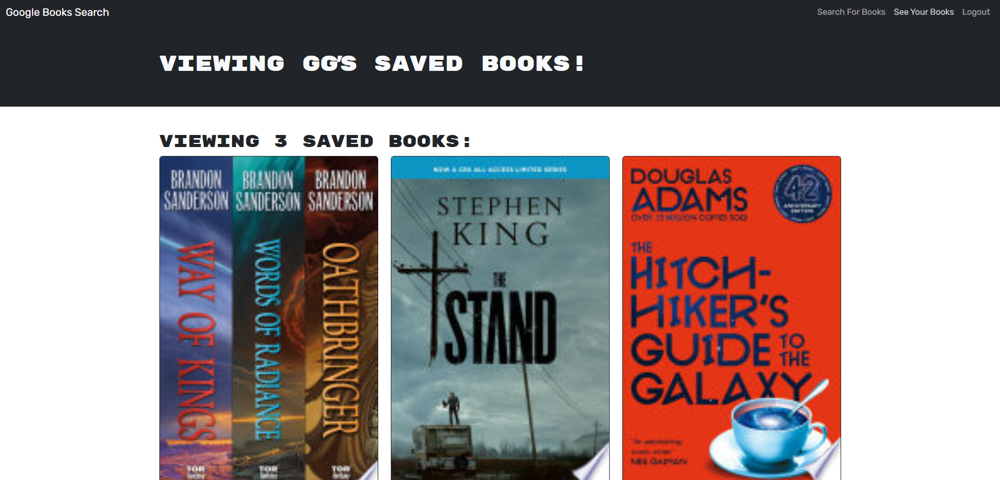

# GQLibrary


## Description

**GQLibrary** is a MERN stack application designed as a book search engine. Originally built with a RESTful API, this app is refactored to use a GraphQL API with Apollo Server. Users can search for books and save their favorite titles to their account. The app includes user authentication and utilizes the Google Books API for book data.

[**LIVE DEMO** 🖥️](https://stunning-nasturtium-ba3d98.netlify.app/)



## Table of Contents

- [GQLibrary](#gqlibrary)
  - [Description](#description)
  - [Table of Contents](#table-of-contents)
  - [Installation](#installation)
  - [Usage](#usage)
  - [Environment Variables](#environment-variables)
  - [Technologies Used](#technologies-used)
  - [License](#license)
  - [Questions](#questions)

## Installation

1. Clone the repository:
   ```bash
   git clone https://github.com/savevsgames/GQLibrary.git
   ```
2. Navigate to the project directory:
   ```bash
   cd GQLibrary
   ```
3. Install dependencies:
   ```bash
   npm install
   ```

## Usage

1. Ensure that the necessary environment variables are set up in a `.env` file (refer to `.env.EXAMPLE` for the required variables).

2. Start the application:
   ```bash
   npm run render:start
   ```
3. By default, the front end will be available at `http://localhost:3000`, and the server/API will be accessible at `http://localhost:3001`.

4. Optionally, you can run the seed and cleanDB scripts to work with "placeholder-data" on the server side:
5. ```bash
   npm run cleanDB // cleans the database named in your .env file as: MONGODB_URI
   npm run seed // seeds the database named in your .env file as: MONGODB_URI
   ```

````

## Environment Variables

- Set up a `.env` file in the server directory with the variables specified in `.env.EXAMPLE`.
- Example:
```dotenv
MONGODB_URI=<your_mongodb_connection_string>
JWT_SECRET=<your_jwt_secret>
````

## Technologies Used

- [Node.js](https://nodejs.org/)
- [Express.js](https://expressjs.com/)
- [React](https://reactjs.org/)
- [MongoDB](https://www.mongodb.com/)
- [Apollo Server](https://www.apollographql.com/docs/apollo-server/)
- [GraphQL](https://graphql.org/)
- [Vite](https://vitejs.dev/)

## License

This project is licensed under the MIT License.

## Questions

For additional questions, please reach out:

- **Author**: Greg Barker
- **Email**: gregcbarker@gmail.com
- **GitHub**: [savevsgames](https://github.com/savevsgames)
