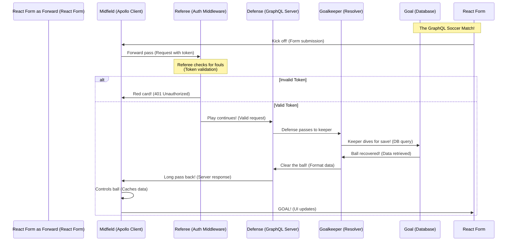

```mermaid
sequenceDiagram
    participant React Form as Forward (React Form)
    participant Apollo as Midfield (Apollo Client)
    participant Auth as Referee (Auth Middleware)
    participant GraphQL as Defense (GraphQL Server)
    participant Resolver as Goalkeeper (Resolver)
    participant MongoDB as Goal (Database)

    Note over React Form,MongoDB: The GraphQL Soccer Match!

    React Form->>Apollo: Kick off! (Form submission)
    
    Apollo->>Auth: Forward pass (Request with token)
    Note over Auth: Referee checks for fouls<br/>(Token validation)
    
    alt Invalid Token
        Auth->>Apollo: Red card! (401 Unauthorized)
    else Valid Token
        Auth->>GraphQL: Play continues! (Valid request)
        
        GraphQL->>Resolver: Defense passes to keeper
        Resolver->>MongoDB: Keeper dives for save! (DB query)
        
        MongoDB->>Resolver: Ball recovered! (Data retrieved)
        Resolver->>GraphQL: Clear the ball! (Format data)
        
        GraphQL->>Apollo: Long pass back! (Server response)
        Apollo->>Apollo: Controls ball (Caches data)
        
        Apollo->>React Form: GOAL! (UI updates)
    end
```